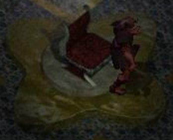

# melf 

(A)Synchronous remote references based on [melf](https://www.npmjs.com/package/melf).
Usage [here](/demo), live demo [here]()
Demonstration by running in two separate terminals:

```sh
rm usage/boxdir/* ; node usage/fantasio.js
```

```sh
node usage/spriou.js
```

## `kalah = require("kalah")(melf, options)`

* `melf :: melf.Melf`
* `options :: object | undefined`
  * `sync :: boolean | undefined`
* `kalah :: object`
  * `alias = ownerof(value)`
    * `value :: *`
    * `alias :: string`
  * `value = import(data, type)`
    * `data :: json`
    * `type :: json | undefined`
    * `value :: *`
  * `data = export(value, type)`
    * `value :: *`
    * `type :: json | undefined`
    * `data :: json`
